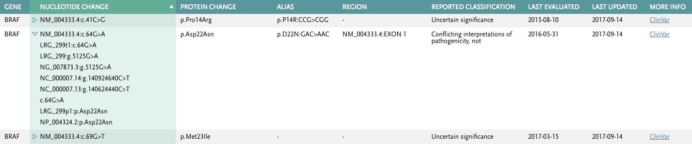

# Variant Search Coding Assignment (VSCA) by Josimar Andrade

# Backend in python

## Assignment

Application that allows a user to search for genomic variants by gene name and display the results in a tabular view.

## Features

1. Allow the user to enter a gene name to search for variants in that gene. Display the results in a table that shows various attributes associated with each genomic variant.

2. Provide an auto-suggest feature for entering the gene name.

3. Provide two RESTful endpoints supporting the functionality listed in steps 1 and 2.

## Datasource

A zipped TSV file of variants is available in /data/variants.tsv.zip. Each row in the TSV file represents a genomic variant and contains a Gene column with the gene name. A variant will belong to one and only one gene, but multiple variants may belong to the same gene.

NOTE: All the development was made on Ubuntu 18.04.3 LTS x86_64

## Implementation

Backend     --> Python

Our expectation is you will be writing some server code, client code, and applying some basic styling to create a working web application. The application should include unit tests.

Here’s an example of how you might group and display the information:

## File directory

└── VSCA
    ├── app.py                  --> application code
    ├── data
    │   └── variants.tsv        --> data file
    ├── example_table.png       --> table example
    ├── README.md               --> this file
    ├── requirements.txt        
    ├── test.py                 --> test file
    └── venv                    --> environment resource

## Installation

Install dependencies:
    pip install
Creating virtual environment¶:
    python3 -m venv env
Activating virtual environment:
    source env/bin/activate

## Tests

Backend:
    python -m unittest test.py
    
Result:
----------------------------------------------------------------------
Ran 6 tests in 1.524s

OK

## Run single server.

start the server:
    python -m flask run       

Leaving the virtual environment
    deactivate

## Usage

API (server service):
    Browser:
        http://localhost:5000/gene/BRAF
        http://localhost:5000/gene/autocomplete/BRA
    Curl test:
        curl http://localhost:5000/gene/autocomplete/BRA
        curl http://localhost:5000/gene/BRAF

## Scalability with Kubernetes

--- Not implemented

## High performance Test

--- Not implemented

## Submitting Your Solution

Please clone this repository and upload an archive to Greenhouse, or upload your repository to GitHub and send us a link. Update this README to include instructions on how to install, test, and run your application. Bonus: Deploy it and include the URL here.

As part of the review process, we may comment on or ask questions about specific parts of the code.

Please return your solution within 1 week. This is not an expectation of the time required to complete the assignment. Rather, it’s meant to provide buffer for busy schedules.

## License
Copyright (c) 2019. Josimar Andrade, No Rights Reserved

